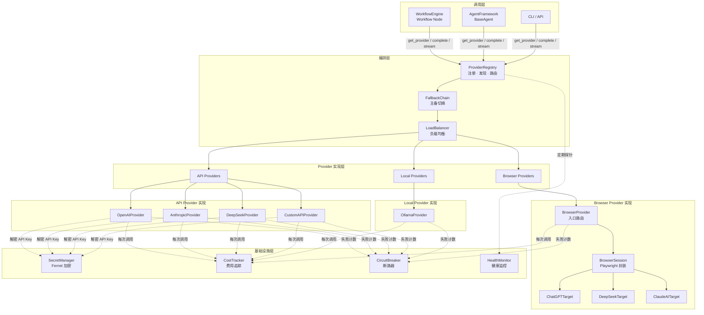
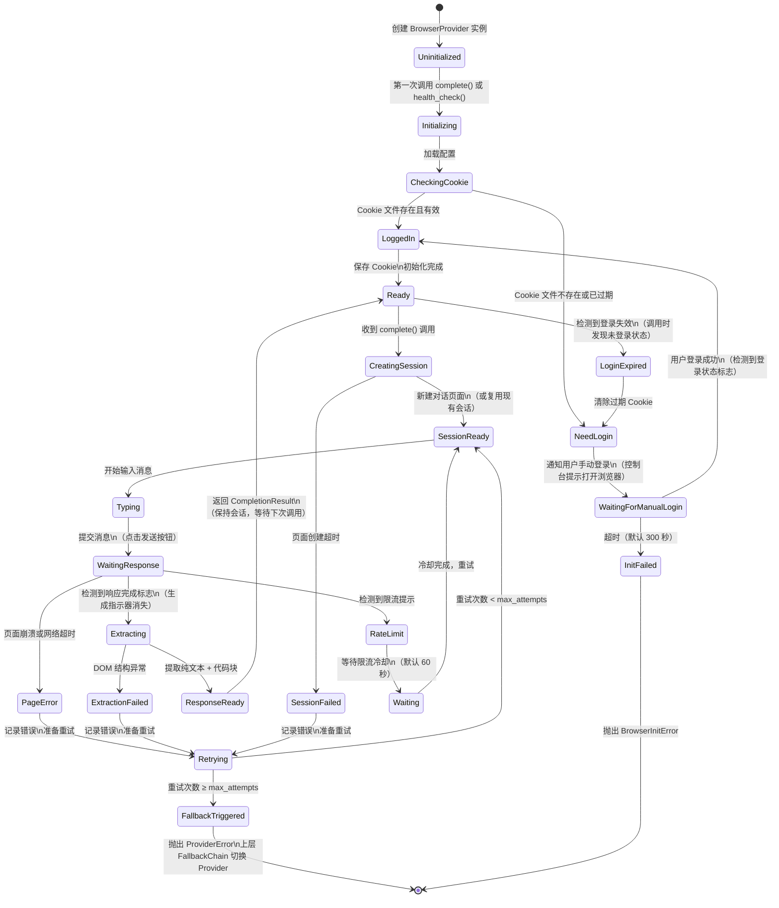
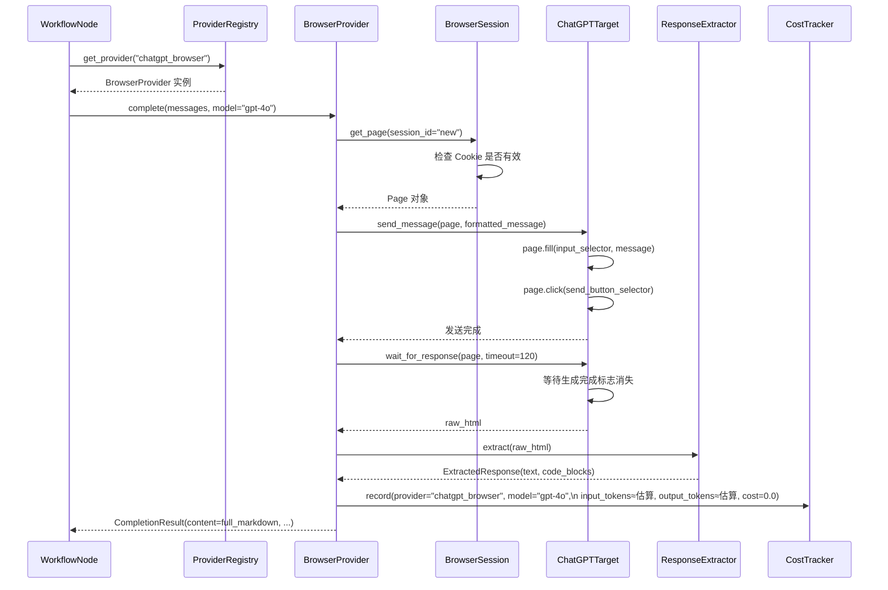
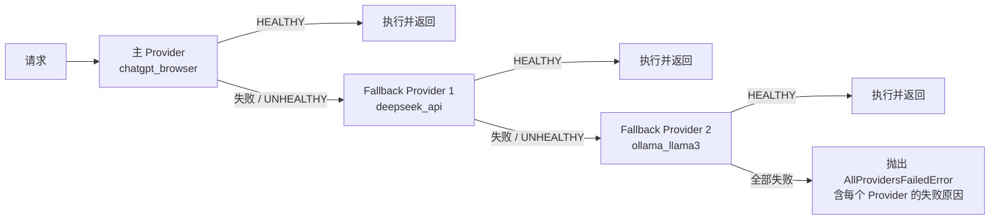
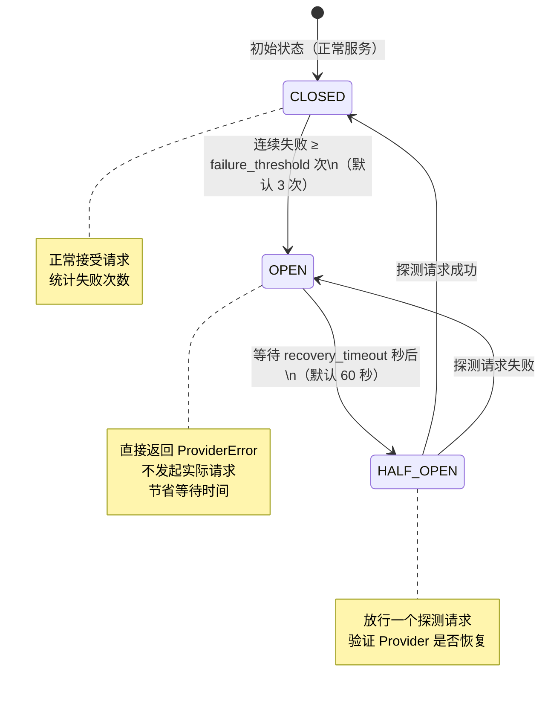

# AI Engineering Execution Platform — Provider Framework 设计文档

> **版本**：v0.1（P4 阶段产出）  
> **角色**：Provider 架构师（Provider Architect）  
> **基于**：[ARCHITECTURE.md](ARCHITECTURE.md) · [DEFINITION_OF_DONE.md](DEFINITION_OF_DONE.md)  
> **参考项目**：`D:\TestAgentPythonProject`（`APIKeyConfig` + `LLMSetting` + Fernet 加密实现）  
> **核心约束**：`import playwright` 仅允许出现在 `platform/providers/browser/` 目录  
> **约束**：本文档为纯设计文档，不包含任何代码实现  
> **日期**：2026-06-23

---

## 目录

1. [Provider Framework 总体架构](#1-provider-framework-总体架构)
2. [统一 Provider 接口设计](#2-统一-provider-接口设计)
3. [API Provider 设计](#3-api-provider-设计)
4. [Local Provider 设计](#4-local-provider-设计)
5. [Browser Provider 设计（重点）](#5-browser-provider-设计重点)
6. [ProviderRegistry 设计](#6-providerregistry-设计)
7. [Fallback 链与 Circuit Breaker 设计](#7-fallback-链与-circuit-breaker-设计)
8. [Cost Tracking 设计](#8-cost-tracking-设计)
9. [密钥管理设计](#9-密钥管理设计)
10. [Provider 配置系统](#10-provider-配置系统)
11. [与参考项目的对比与演进分析](#11-与参考项目的对比与演进分析)
12. [目录结构总览](#12-目录结构总览)

---

## 1. Provider Framework 总体架构

### 1.1 分层架构图



**为什么这样分层**：

- 调用层只看到 `ProviderRegistry`，不知道任何具体实现，实现了完全的 Provider 无关性
- Browser Provider 与 API Provider 在编排层完全平等，调用方无法区分
- 基础设施层（费用追踪、断路器、健康监控）横切所有 Provider，通过装饰器模式注入，不污染业务逻辑

---

## 2. 统一 Provider 接口设计

### 2.1 接口定义（伪代码）

```
# platform/core/interfaces/provider.py
# 所有 Provider 必须实现此接口，无例外

enum ProviderType:
    API     # 通过 HTTP 调用官方 API
    LOCAL   # 调用本地运行的模型
    BROWSER # 通过 Playwright 操作网页版 AI

enum HealthStatus:
    HEALTHY
    DEGRADED    # 可用但响应慢或错误率偏高
    UNHEALTHY   # 不可用

dataclass HealthCheckResult:
    status: HealthStatus
    latency_ms: int | None
    message: str | None
    checked_at: datetime

dataclass Message:
    role: str           # "system" | "user" | "assistant"
    content: str
    name: str | None    # 多 Agent 场景下的发言者名称

dataclass CompletionResult:
    content: str
    model: str
    input_tokens: int
    output_tokens: int
    finish_reason: str  # "stop" | "length" | "tool_calls"
    raw_response: dict  # 原始响应，用于调试
    provider_name: str
    duration_ms: int

dataclass StreamChunk:
    delta: str          # 本次增量文本
    is_final: bool      # 是否为最后一个 chunk
    finish_reason: str | None

interface LLMProvider:
    # 身份属性
    name: str                   # 全局唯一标识符（如 "openai_gpt4o"）
    display_name: str           # 人类可读名称（如 "OpenAI GPT-4o"）
    provider_type: ProviderType
    supported_models: list[str] # 支持的模型列表（空列表表示支持任意）

    # 核心调用方法
    async complete(
        messages: list[Message],
        model: str,
        temperature: float = 0.7,
        max_tokens: int = 4096,
        **kwargs                # 预留扩展（stop_sequences、top_p 等）
    ) -> CompletionResult

    async stream(
        messages: list[Message],
        model: str,
        temperature: float = 0.7,
        max_tokens: int = 4096,
        **kwargs
    ) -> AsyncIterator[StreamChunk]

    # 辅助方法
    async count_tokens(messages: list[Message]) -> int

    async health_check() -> HealthCheckResult

    def get_cost(
        input_tokens: int,
        output_tokens: int,
        model: str
    ) -> float              # 返回 USD，Browser/Local 返回 0.0
```

### 2.2 接口设计决策

**为什么 `complete` 和 `stream` 都是必须实现的**：
- Browser Provider 天然是流式的（看着文字逐渐出现）
- API Provider 可以选择流式或非流式
- 统一要求两个方法，使调用方可以在任何 Provider 上使用流式输出

**为什么 `get_cost` 是同步方法而不是 async**：
- 费用计算是纯数学运算，不涉及 IO，没有理由异步
- 保持简单：`cost = provider.get_cost(100, 200, "gpt-4o")`

**为什么 `count_tokens` 是 async**：
- API Provider 可以通过本地 tiktoken 计算（同步），也可以调用远程 token 计数 API（异步）
- Browser Provider 无法精确计数，需要调用本地估算逻辑（异步统一接口）
- 统一为 async，调用方不需要区分

**为什么有 `supported_models` 属性**：
- ProviderRegistry 可以按模型名称查询支持该模型的 Provider
- 例如：查询支持 `gpt-4o` 的 Provider，Registry 路由到 `OpenAIProvider`

---

## 3. API Provider 设计

### 3.1 类层次结构

```
LLMProvider（接口）
    └── BaseAPIProvider（基类，处理通用 HTTP 逻辑）
            ├── OpenAICompatibleProvider（处理 OpenAI 格式 API）
            │       ├── OpenAIProvider（base_url="https://api.openai.com/v1"）
            │       ├── DeepSeekProvider（base_url="https://api.deepseek.com/v1"）
            │       └── CustomAPIProvider（用户自定义 base_url）
            └── AnthropicProvider（专有格式，使用 anthropic SDK）
```

**为什么 OpenAI、DeepSeek、Custom 共用同一基类**：
DeepSeek 兼容 OpenAI API 格式，只是 `base_url` 不同。共用基类可以避免重复实现完全相同的逻辑，仅通过配置区分。未来新增任何兼容 OpenAI 格式的 Provider（如 Groq、Together.ai），只需传入不同 `base_url` 即可。

### 3.2 BaseAPIProvider 职责

```
BaseAPIProvider 负责：
    - 从 SecretManager 获取解密后的 API Key
    - 构造 HTTP 请求（headers、body）
    - 处理 429 Rate Limit（自动等待 retry-after 头）
    - 处理 503 Service Unavailable（触发 Fallback）
    - 统一的超时设置（connect_timeout=10s, read_timeout=120s）
    - 将响应映射到 CompletionResult 标准格式

子类只需实现：
    - _build_request_body(messages, model, **kwargs) → dict
    - _parse_response(raw: dict) → CompletionResult
    - _parse_stream_chunk(raw: dict) → StreamChunk
    - _count_tokens_local(messages) → int（本地估算）
    - PRICING: dict[str, tuple[float, float]]（模型 → (输入价/千token, 输出价/千token)）
```

### 3.3 各 API Provider 定价表（设计时固化，运行时可覆盖）

```
OpenAIProvider.PRICING = {
    "gpt-4o":          (0.0025, 0.010),   # per 1K tokens: input, output
    "gpt-4o-mini":     (0.00015, 0.0006),
    "gpt-4-turbo":     (0.010, 0.030),
    "o1":              (0.015, 0.060),
    "o1-mini":         (0.003, 0.012),
}

AnthropicProvider.PRICING = {
    "claude-sonnet-4-6":             (0.003, 0.015),
    "claude-opus-4-8":               (0.015, 0.075),
    "claude-haiku-4-5-20251001":     (0.00025, 0.00125),
}

DeepSeekProvider.PRICING = {
    "deepseek-chat":     (0.00027, 0.0011),
    "deepseek-reasoner": (0.00055, 0.0022),
}
```

**为什么把定价硬编码在 Provider 类中**：
定价是 Provider 的属性，不是配置。将其放在类中使 `get_cost()` 无需外部依赖即可计算，且有明确的审查点（更新定价时修改对应 Provider 类）。提供覆盖机制供用户在 YAML 配置中自定义。

---

## 4. Local Provider 设计

### 4.1 OllamaProvider

```
OllamaProvider:
    默认 base_url: "http://localhost:11434"
    协议: Ollama REST API（非 OpenAI 格式，但结构相似）

    health_check():
        GET /api/tags → 检查 Ollama 服务是否运行
        超时 2 秒，超时返回 UNHEALTHY

    complete(messages, model, ...):
        POST /api/chat
        body: {"model": model, "messages": messages, "stream": false}
        响应映射：response.message.content → CompletionResult.content
        input_tokens / output_tokens: 从 response.prompt_eval_count 等字段读取

    stream(messages, model, ...):
        POST /api/chat
        body: {"model": model, "messages": messages, "stream": true}
        逐行读取 NDJSON（每行一个 JSON 对象）
        提取 response.message.content 作为 StreamChunk.delta

    get_cost(input_tokens, output_tokens, model):
        return 0.0  # 本地模型无费用

    count_tokens(messages):
        使用 tiktoken（llama3 tokenizer）本地估算
        注意：不同模型 tokenizer 不同，此处为估算，存在误差
```

**为什么选择 Ollama 而不是直接调用 llama.cpp**：
Ollama 提供统一的 REST API，支持多种本地模型（Llama、Mistral、Gemma 等），用户体验好，无需为每个模型单独实现接口。且 Ollama 的 API 与 OpenAI 格式高度相似，降低实现成本。

---

## 5. Browser Provider 设计（重点）

### 5.1 核心约束声明

> **硬性约束**：`import playwright`（以及任何 playwright 子模块）仅允许出现在以下路径：
> ```
> platform/providers/browser/session.py
> platform/providers/browser/targets/*.py
> platform/providers/browser/base_browser_provider.py
> ```
> 违反此约束的代码不允许合并，CI 中有自动检测。

**为什么这条约束如此重要**：
Playwright 是一个重量级依赖，携带浏览器驱动、网络拦截等能力。如果它泄漏到核心引擎，会导致：
1. 每个使用核心引擎的测试都需要安装浏览器（测试速度骤降）
2. Browser Provider 的实现细节污染业务逻辑（高耦合）
3. 无法在不安装 Playwright 的环境中运行平台（如 CI 无头环境）

---

### 5.2 目录结构

```
platform/providers/browser/          ← 唯一允许 import playwright 的目录
├── __init__.py                       # 导出 BrowserProvider（对外唯一入口）
├── browser_provider.py               # BrowserProvider：实现 LLMProvider 接口，路由到 targets
├── base_browser_provider.py          # 抽象基类：封装通用 Browser Provider 逻辑
├── session.py                        # BrowserSession：Playwright 生命周期管理
├── cookie_manager.py                 # Cookie 文件的保存/加载/验证
├── response_extractor.py             # 从 DOM 提取文本和代码块
├── stealth.py                        # 反检测措施配置
└── targets/
    ├── __init__.py
    ├── base_target.py                # BaseBrowserTarget：定义 target 接口
    ├── chatgpt.py                    # ChatGPTTarget：chat.openai.com 操作逻辑
    ├── deepseek.py                   # DeepSeekTarget：chat.deepseek.com 操作逻辑
    └── claude_ai.py                  # ClaudeAITarget：claude.ai 操作逻辑
```

---

### 5.3 Browser Provider 完整状态机



**状态机设计决策**：

| 状态 | 设计考量 |
|------|---------|
| `NeedLogin → WaitingForManualLogin` | 不自动填写账号密码（安全风险），而是提示用户手动登录，平台保存 Cookie |
| `RateLimit → Waiting` | 遇到限流不立即 Fallback，而是等待冷却，节省 API 费用 |
| `Retrying → FallbackTriggered` | 重试耗尽才触发 Fallback，减少不必要的 Provider 切换 |
| `LoginExpired → NeedLogin` | 检测登录失效后不抛出异常，而是触发重新登录流程 |

---

### 5.4 各组件详细设计

#### 5.4.1 BrowserSession（Playwright 封装层）

```
BrowserSession 的职责：
    封装所有 Playwright 对象的生命周期管理。
    外部组件只与 BrowserSession 交互，不直接持有 playwright 对象。

BrowserSession:
    _playwright: Playwright | None
    _browser: Browser | None
    _context: BrowserContext | None  # 带 Cookie 的浏览器上下文
    _pages: dict[str, Page]         # 会话 ID → Page 对象（会话池）

    async initialize(config: BrowserConfig):
        1. 启动 Playwright（playwright.chromium.launch(headless=config.headless)）
        2. 创建带 stealth 配置的 BrowserContext
        3. 加载 Cookie（如果存在）
        4. 设置 User-Agent、viewport、locale（反检测）

    async get_page(session_id: str) → Page:
        如果 session_id 在 _pages 中且页面未关闭，返回现有 Page
        否则创建新 Page，存入 _pages

    async save_cookies(path: str):
        context.storage_state(path=path)（保存完整 Cookie + localStorage）

    async close():
        关闭所有 Page → 关闭 Browser → 停止 Playwright

    # 会话池大小限制
    MAX_SESSIONS = 5  # 避免占用过多内存
```

#### 5.4.2 BaseBrowserTarget（目标网站抽象接口）

```
BaseBrowserTarget:
    target_name: str                  # "chatgpt" | "deepseek" | "claude_ai"
    base_url: str                     # 网站入口 URL
    login_check_selector: str        # 用于检测是否已登录的 CSS 选择器
    input_selector: str              # 消息输入框选择器
    send_button_selector: str        # 发送按钮选择器
    response_container_selector: str # AI 响应容器选择器
    completion_indicator: str        # 响应完成标志（CSS 选择器或 JS 表达式）

    # 必须由子类实现的方法
    async is_logged_in(page: Page) → bool
    async send_message(page: Page, message: str) → None
    async wait_for_response(page: Page, timeout: int) → str   # 返回原始 HTML
    async extract_text(raw_html: str) → ExtractedResponse     # 提取结构化响应

    # 可选覆盖（有默认实现）
    async handle_rate_limit(page: Page) → int    # 返回等待秒数
    async handle_new_conversation(page: Page) → None
    async split_long_message(message: str) → list[str]  # 超长消息分段
```

#### 5.4.3 ChatGPT Target 设计细节

```
ChatGPTTarget(BaseBrowserTarget):
    target_name: "chatgpt"
    base_url: "https://chat.openai.com"

    # 选择器（基于 2026 年页面结构，需定期维护）
    login_check_selector: "[data-testid='profile-button']"
    input_selector: "#prompt-textarea"
    send_button_selector: "[data-testid='send-button']"
    response_container_selector: "[data-message-author-role='assistant']"
    completion_indicator: "button[data-testid='stop-button']"  # 生成中时此按钮存在

    is_logged_in(page):
        等待 login_check_selector 出现（timeout=5s）
        出现 → True，超时 → False

    send_message(page, message):
        page.click(input_selector)
        page.fill(input_selector, "")   # 清空（防止残留内容）
        # 超长消息分段输入（ChatGPT 输入框有字符限制）
        for chunk in split_message(message, max_chars=30000):
            page.type(input_selector, chunk)
            随机 delay(50-150ms)  # 模拟人工输入速度
        page.click(send_button_selector)

    wait_for_response(page, timeout):
        # 等待发送按钮消失（发送中）
        page.wait_for_selector(send_button_selector, state="hidden", timeout=10000)
        # 等待停止按钮出现（生成中）
        page.wait_for_selector(completion_indicator, state="visible", timeout=10000)
        # 等待停止按钮消失（生成完成）
        page.wait_for_selector(completion_indicator, state="hidden", timeout=timeout*1000)
        # 获取最后一条 assistant 消息的 HTML
        elements = page.query_selector_all(response_container_selector)
        return elements[-1].inner_html()

    处理限流：
        检测页面是否出现 "You've reached our limit" 文本
        → 返回等待时间（解析页面中的剩余时间）
```

#### 5.4.4 ResponseExtractor（响应提取）

```
ExtractedResponse:
    plain_text: str          # 纯文本内容（去除 HTML 标签）
    code_blocks: list[CodeBlock]   # 提取的代码块列表
    full_markdown: str       # 重建的 Markdown 格式（文本 + 代码块）

CodeBlock:
    language: str | None     # 编程语言（从 ```python 中提取）
    code: str                # 代码内容

ResponseExtractor.extract(html: str) → ExtractedResponse:
    使用 BeautifulSoup 解析 HTML：
    1. 提取 <code> 和 <pre> 标签中的代码块，记录语言
    2. 将代码块替换为占位符
    3. 提取剩余文本（strip HTML tags）
    4. 重建 Markdown：文本段落 + ```language\ncode\n```
    5. 返回 ExtractedResponse

注意事项：
    - 不同 AI 网站的代码块 HTML 结构不同，由各 Target 子类提供选择器
    - ChatGPT 代码块：<pre><code class="language-python">...</code></pre>
    - DeepSeek 代码块：<div class="md-code-block"><code>...</code></div>
    - Claude.ai 代码块：类似 ChatGPT 但 class 名称不同
```

#### 5.4.5 StealhConfig（反检测配置）

```
stealth 配置（在 BrowserSession.initialize() 中应用）：

1. User-Agent 随机化
   随机选择 ChromeUA 列表中的一个真实 User-Agent
   （每次启动 Session 时固定，同一 Session 不变）

2. WebDriver 标志清除
   navigator.webdriver = undefined（禁用自动化检测）
   通过 page.add_init_script() 在每个页面加载时注入

3. 随机延迟策略
   - 打开页面后：random.uniform(1.0, 3.0) 秒
   - 填写输入前：random.uniform(0.3, 0.8) 秒
   - 字符输入间隔：random.uniform(0.05, 0.15) 秒/字符
   - 点击发送后：random.uniform(0.5, 1.0) 秒

4. 视口和语言设置
   viewport: random choice from [(1920,1080), (1440,900), (1366,768)]
   locale: "en-US"（不使用中文，避免触发异常检测）

5. 不使用 Playwright 的 page.goto 的默认 HTTP 头
   添加真实浏览器的 Accept-Language、Referer 等头
```

**为什么需要反检测**：
目标网站（ChatGPT 等）有自动化检测机制。不加反检测措施，平台可能在几次调用后被识别为机器人并被临时封禁。反检测不是为了绕过安全机制，而是为了让工具正常工作（类似于爬虫遵守 robots.txt 的精神，但我们的场景是使用自己的账号访问自己有权使用的服务）。

---

### 5.5 Browser Provider 完整调用序列



---

### 5.6 Browser Provider 配置格式（YAML）

```yaml
providers:
  chatgpt_browser:
    type: browser
    display_name: "ChatGPT (Browser)"
    target: chatgpt                      # 路由到 ChatGPTTarget
    browser: chromium                    # chromium | firefox | webkit
    headless: true                       # 生产环境建议 headless=true
    auth:
      method: cookie_file
      cookie_path: .secrets/chatgpt_cookies.json
      login_timeout: 300                 # 等待手动登录的秒数
    session:
      reuse: true                        # 复用已有会话
      max_sessions: 3                    # 最多同时持有 3 个会话
      idle_timeout: 1800                 # 30 分钟无请求则关闭会话
    retry:
      max_attempts: 3
      delay_seconds: 5
      backoff_factor: 2                  # 指数退避：5s, 10s, 20s
    rate_limit:
      cooldown_seconds: 60               # 遇到限流时等待 60 秒
      auto_fallback_after: 2             # 连续限流 2 次后切换 Fallback
    stealth:
      enabled: true
      random_delay: true
    fallback: deepseek_api               # 失败时切换到的备用 Provider

  deepseek_browser:
    type: browser
    target: deepseek
    browser: chromium
    headless: true
    auth:
      method: cookie_file
      cookie_path: .secrets/deepseek_cookies.json
    retry:
      max_attempts: 3
      delay_seconds: 3
    fallback: deepseek_api

  claude_browser:
    type: browser
    target: claude_ai
    browser: chromium
    headless: true
    auth:
      method: cookie_file
      cookie_path: .secrets/claude_cookies.json
    retry:
      max_attempts: 3
      delay_seconds: 5
    fallback: anthropic_api
```

---

## 6. ProviderRegistry 设计

### 6.1 核心接口

```
ProviderRegistry（全局单例）:

    # 注册
    register(provider: LLMProvider) → None
        验证 provider 实现了 LLMProvider 接口
        检查 provider.name 是否冲突（冲突则告警并覆盖）
        存入 _registry[provider.name]

    # 发现
    get(name: str) → LLMProvider
        返回指定名称的 Provider
        不存在则抛出 ProviderNotFoundError

    get_by_type(type: ProviderType) → list[LLMProvider]
        返回指定类型的所有 Provider

    get_for_model(model: str) → LLMProvider | None
        查找 supported_models 包含该 model 的 Provider
        多个匹配时返回健康状态最好的那个

    list_all() → list[ProviderInfo]
        返回所有已注册 Provider 的摘要信息（含健康状态、费用统计）

    # 健康监控
    async start_health_monitoring(interval: int = 60) → None
        启动后台任务，每 interval 秒对所有 Provider 执行 health_check()
        将结果存入 _health_cache

    get_health(name: str) → HealthCheckResult
        返回缓存的健康检查结果（避免每次调用都触发实时检查）

    # 成本控制
    set_budget(
        daily_limit_usd: float | None,
        monthly_limit_usd: float | None
    ) → None

    check_budget() → BudgetStatus
        BudgetStatus: OK | WARNING(> 80%) | EXCEEDED
        EXCEEDED 时：拒绝新的 API Provider 请求，但允许 Browser/Local Provider（零成本）
```

### 6.2 负载均衡策略

```
当多个同类 Provider 可用时（如配置了 3 个不同的 OpenAI Key）：

策略 1：Round Robin（默认）
    按顺序轮流分配请求

策略 2：Least Cost
    选择单次请求预计费用最低的 Provider

策略 3：Lowest Latency
    基于最近 10 次调用的平均响应时间，选择最快的 Provider

策略 4：Quality First
    基于 Benchmark 历史得分，选择质量最高的 Provider

配置方式（YAML）：
  registry:
    load_balancing:
      strategy: round_robin  # round_robin | least_cost | lowest_latency | quality_first
      fallback_on_unhealthy: true
```

### 6.3 Provider 启动初始化流程

```
平台启动时：
    1. 读取 config/providers.yaml
    2. 对每个 provider 配置：
        a. 实例化对应的 Provider 类
        b. 调用 health_check()（快速验证可用性）
        c. 注册到 ProviderRegistry
    3. 启动后台健康监控协程
    4. 日志输出所有 Provider 状态摘要

输出示例：
    [INFO] Provider 初始化完成
    [INFO]   ✅ openai_gpt4o       (API)     HEALTHY  延迟 230ms
    [INFO]   ✅ deepseek_chat      (API)     HEALTHY  延迟 890ms
    [INFO]   ✅ ollama_llama3      (LOCAL)   HEALTHY  延迟 45ms
    [INFO]   ⚠️ chatgpt_browser   (BROWSER) DEGRADED Cookie 即将过期（7天后）
    [INFO]   ❌ claude_browser    (BROWSER) UNHEALTHY 未登录，需要手动初始化
```

---

## 7. Fallback 链与 Circuit Breaker 设计

### 7.1 Fallback 链



**Fallback 链配置（YAML）**：

```yaml
# 方式 1：在 Provider 配置中指定 fallback（单链）
providers:
  chatgpt_browser:
    fallback: deepseek_api        # chatgpt → deepseek_api

  deepseek_api:
    fallback: ollama_llama3       # deepseek_api → ollama（链式）

# 方式 2：全局 Fallback 策略
fallback_policy:
  default_chain:
    - chatgpt_browser
    - deepseek_api
    - anthropic_claude
    - ollama_llama3
  override_by_task:
    validation_task:              # 验证任务优先用高质量 API Provider
      - anthropic_claude
      - openai_gpt4o
    cheap_task:                   # 便宜任务优先用免费 Provider
      - chatgpt_browser
      - ollama_llama3
      - deepseek_api
```

### 7.2 Circuit Breaker（断路器）



**Circuit Breaker 配置（YAML）**：

```yaml
circuit_breaker:
  enabled: true
  failure_threshold: 3        # 连续失败 3 次 → OPEN
  recovery_timeout: 60        # OPEN 状态持续 60 秒后 → HALF_OPEN
  success_threshold: 1        # HALF_OPEN 时成功 1 次 → CLOSED
  
  # Browser Provider 用宽松标准（网络波动较多）
  overrides:
    chatgpt_browser:
      failure_threshold: 5    # 连续失败 5 次才断路
      recovery_timeout: 120   # 断路后等待 2 分钟再探测
```

**为什么需要断路器**：
没有断路器时，一个不可用的 Provider 每次被调用都会等待超时（可能 30 秒），严重影响整体响应速度。断路器让故障 Provider "快速失败"，立即触发 Fallback，保护整体系统的响应时间。

---

## 8. Cost Tracking 设计

### 8.1 费用记录数据结构

```
CostRecord:
    id: UUID
    timestamp: datetime
    provider_name: str               # "openai_gpt4o"
    provider_type: ProviderType      # API | LOCAL | BROWSER
    model: str                       # "gpt-4o"
    run_id: str | None               # 关联的工作流 Run ID
    task_type: str | None            # 任务类型（如 "book_chapter"）
    input_tokens: int
    output_tokens: int
    total_tokens: int
    cost_usd: float                  # Browser/Local 为 0.0
    duration_ms: int
    status: str                      # "success" | "error"
    error_type: str | None           # 失败时的错误类型
```

### 8.2 费用汇总查询

```
CostTracker:

    async record(record: CostRecord) → None
        持久化到 SQLite cost_records 表

    async get_total(
        start: datetime,
        end: datetime,
        provider: str | None = None,
        task_type: str | None = None
    ) → CostSummary

    CostSummary:
        total_cost_usd: float
        total_calls: int
        total_tokens: int
        by_provider: dict[str, ProviderCostSummary]
        by_task_type: dict[str, float]
        by_day: dict[date, float]        # 时序数据

    async get_budget_status() → BudgetStatus
        对比今日/本月累计费用与 ProviderRegistry 的预算设置

    async generate_report(
        period: str = "today"            # "today" | "week" | "month"
    ) → str                              # Markdown 格式费用报告
```

### 8.3 费用报告示例

```markdown
## 费用报告 — 2026-06-23

### 汇总
- 总调用次数：247 次
- 总费用：$1.24 USD
- 总 Token：1,240,000

### 按 Provider 分布
| Provider             | 调用次数 | 费用 USD | 平均延迟 |
|---------------------|---------|---------|---------|
| openai_gpt4o        | 45      | $0.68   | 1,230ms |
| deepseek_chat       | 120     | $0.52   | 890ms   |
| anthropic_claude    | 12      | $0.04   | 1,450ms |
| chatgpt_browser     | 35      | $0.00   | 8,200ms |
| ollama_llama3       | 35      | $0.00   | 320ms   |

### 按任务类型分布
| 任务类型         | 调用次数 | 费用 USD |
|----------------|---------|---------|
| book_chapter   | 180     | $0.95   |
| validation     | 55      | $0.28   |
| summarization  | 12      | $0.01   |

### 预算状态
- 今日预算：$5.00
- 今日使用：$1.24（24.8%）⚠️（预警阈值 80% = $4.00）
```

---

## 9. 密钥管理设计

### 9.1 设计原则（源自参考项目）

参考项目 `TestAgentPythonProject` 的 `APIKeyConfig` + `_get_fernet()` 实现展示了良好的密钥管理模式：

1. **API Key 永不明文存储**：Fernet 对称加密，数据库只存加密后的值
2. **脱敏展示**：前 3 位 + `...` + 后 4 位（`sk-...abcd`）
3. **加密密钥来源**：优先使用 `ENCRYPTION_KEY` 环境变量，回退到从 `SECRET_KEY` 派生
4. **审计日志**：每次 API Key 的增删改都写入审计日志

本平台在此基础上扩展：

### 9.2 SecretManager（本平台的扩展设计）

```
SecretManager:
    # 底层与参考项目相同：Fernet 加密
    # 扩展：支持多个加密源

    async get_api_key(provider: str) → str:
        """解密并返回明文 API Key（不缓存，每次调用都解密）"""
        来源优先级：
        1. 环境变量（OPENAI_API_KEY、ANTHROPIC_API_KEY 等）
        2. 加密配置文件（config/secrets.enc）
        3. 数据库（api_key_configs 表，与参考项目兼容）

    async save_api_key(provider: str, plaintext_key: str) → None:
        使用 Fernet 加密
        存储脱敏 hint
        写入审计日志

    async rotate_api_key(provider: str, new_key: str) → None:
        保留旧 key 的历史记录（加密存储，便于回滚）
        更新为新 key

    def validate_key_format(provider: str, key: str) → bool:
        OpenAI: 以 "sk-" 开头
        Anthropic: 以 "sk-ant-" 开头
        DeepSeek: 以 "sk-" 开头
        其他: 只验证最小长度

对比参考项目的改进：
    ✅ 保留：Fernet 加密、脱敏 hint、审计日志
    ✅ 新增：环境变量优先（更适合 CI/CD 环境）
    ✅ 新增：密钥轮换支持
    ✅ 新增：密钥格式验证
    ✅ 新增：多加密源（文件 + 数据库）
    ❌ 移除：对 SQLAlchemy ORM 的强依赖（改为支持多种存储后端）
```

---

## 10. Provider 配置系统

### 10.1 完整配置文件示例

```yaml
# config/providers.yaml

# 全局设置
defaults:
  temperature: 0.7
  max_tokens: 4096
  timeout_seconds: 120

# 预算控制
budget:
  daily_limit_usd: 10.0
  monthly_limit_usd: 200.0
  warning_threshold: 0.80      # 80% 时告警

# 负载均衡
load_balancing:
  strategy: quality_first
  health_check_interval: 60    # 每 60 秒检查一次健康状态

# Circuit Breaker
circuit_breaker:
  enabled: true
  failure_threshold: 3
  recovery_timeout: 60

# Provider 定义
providers:

  # API Providers
  openai_gpt4o:
    type: api
    class: OpenAIProvider
    display_name: "OpenAI GPT-4o"
    models: [gpt-4o, gpt-4o-mini, gpt-4-turbo, o1, o1-mini]
    auth:
      key_env: OPENAI_API_KEY    # 优先从环境变量读取
      key_name: openai           # 备选：从 SecretManager 读取
    limits:
      requests_per_minute: 60
      tokens_per_minute: 800000

  anthropic_claude:
    type: api
    class: AnthropicProvider
    display_name: "Anthropic Claude"
    models: [claude-sonnet-4-6, claude-opus-4-8, claude-haiku-4-5-20251001]
    auth:
      key_env: ANTHROPIC_API_KEY
      key_name: anthropic
    limits:
      requests_per_minute: 50

  deepseek_api:
    type: api
    class: DeepSeekProvider
    display_name: "DeepSeek (API)"
    models: [deepseek-chat, deepseek-reasoner]
    auth:
      key_env: DEEPSEEK_API_KEY
      key_name: deepseek
    limits:
      requests_per_minute: 100

  # Local Providers
  ollama_llama3:
    type: local
    class: OllamaProvider
    display_name: "Ollama Llama3 (Local)"
    base_url: "http://localhost:11434"
    models: [llama3, llama3:8b, llama3:70b, mistral, gemma2]
    default_model: llama3

  # Browser Providers
  chatgpt_browser:
    type: browser
    class: BrowserProvider
    display_name: "ChatGPT (Browser)"
    target: chatgpt
    browser: chromium
    headless: true
    auth:
      method: cookie_file
      cookie_path: .secrets/chatgpt_cookies.json
    session:
      reuse: true
      max_sessions: 2
      idle_timeout: 1800
    retry:
      max_attempts: 3
      delay_seconds: 5
      backoff_factor: 2
    stealth:
      enabled: true
    fallback: deepseek_api

  deepseek_browser:
    type: browser
    class: BrowserProvider
    display_name: "DeepSeek Chat (Browser)"
    target: deepseek
    browser: chromium
    headless: true
    auth:
      method: cookie_file
      cookie_path: .secrets/deepseek_cookies.json
    retry:
      max_attempts: 3
      delay_seconds: 3
    stealth:
      enabled: true
    fallback: deepseek_api

# 默认 Fallback 链（按任务类型）
fallback_chains:
  default:
    - deepseek_api
    - openai_gpt4o
    - ollama_llama3
  validation:              # 验证任务用高质量模型
    - anthropic_claude
    - openai_gpt4o
    - deepseek_api
  free_only:               # 零成本链（开发/测试用）
    - chatgpt_browser
    - deepseek_browser
    - ollama_llama3
```

---

## 11. 与参考项目的对比与演进分析

### 11.1 参考项目现有设计（TestAgentPythonProject）

| 组件 | 实现方式 | 优点 | 局限 |
|------|---------|------|------|
| `LLMSetting` | SQLAlchemy ORM，键值对存储 default_model / max_tokens / temperature | 简单、可 CRUD | 只有 3 个配置项，不可扩展 |
| `APIKeyConfig` | SQLAlchemy ORM，Fernet 加密存储 | 安全、有脱敏 | 只支持 API Key，无法存储 Cookie/Token |
| `_get_fernet()` | 从 `ENCRYPTION_KEY` 或 `SECRET_KEY` 派生 | 灵活，支持环境变量 | 每次调用都派生，有性能浪费 |
| Provider 支持 | deepseek / openai / anthropic / custom | 覆盖主流 API | 无 Browser/Local Provider |
| 可用模型列表 | 硬编码在 `AVAILABLE_MODELS` | 直观 | 无法动态更新，无健康检查 |
| 审计日志 | MongoDB ConfigAuditLog | 完整的变更追踪 | 仅审计配置变更，无调用日志 |

### 11.2 本平台的演进策略

```
保留并复用（不重新发明）：
    ✅ Fernet 加密机制（_get_fernet 的逻辑完全可以复用）
    ✅ 脱敏 hint 格式（前3位...后4位）
    ✅ 审计日志理念（扩展到覆盖所有 Provider 调用）
    ✅ 支持的 Provider 类型（deepseek/openai/anthropic/custom）

扩展（在参考项目基础上增加）：
    ➕ Browser Provider（全新类型，需要 BrowserSession + Target）
    ➕ Local Provider（Ollama）
    ➕ ProviderRegistry（统一注册/发现机制）
    ➕ Fallback 链和 Circuit Breaker
    ➕ 健康监控（后台定期 health_check）
    ➕ Cost Tracking（每次调用记录费用）
    ➕ 负载均衡（多 Provider 请求分发）
    ➕ 统一 LLMProvider 接口（参考项目无统一接口）

改进（修复参考项目的局限）：
    🔄 配置存储：从 SQLAlchemy ORM 迁移到 Pydantic Settings + YAML（更轻量）
    🔄 密钥存储：支持多来源（env > 文件 > 数据库），参考项目只有数据库
    🔄 可用模型：从硬编码列表改为每个 Provider 类的 supported_models 属性
    🔄 加密密钥缓存：_get_fernet() 结果缓存（参考项目每次调用都重新派生）

不迁移（参考项目专用）：
    ❌ SQLAlchemy / FastAPI 依赖（本平台是 CLI 工具，不是 Web 服务）
    ❌ MongoDB 审计日志（本平台用 SQLite + 结构化日志）
    ❌ 用户认证 / CurrentUserIdDep（本平台初期为单用户）
```

### 11.3 兼容性路径

如果未来需要将本平台与 `TestAgentPythonProject` 集成（共享一套 LLM 配置）：

```
方案：SecretManager 支持从 TestAgentPythonProject 的数据库读取 APIKeyConfig

SecretManager.get_api_key(provider) 的来源优先级：
    1. 环境变量（最高优先级，CI/CD 友好）
    2. 本平台的 .secrets/ 目录（加密文件）
    3. TestAgentPythonProject 数据库（兼容模式，可选开启）

配置开关：
    secrets:
      compat_mode:
        enabled: false            # 是否读取参考项目的数据库
        db_url: postgresql://...  # 参考项目的数据库连接
```

---

## 12. 目录结构总览

```
platform/providers/
│
├── __init__.py                     # 导出 ProviderRegistry, LLMProvider 等公开接口
├── registry.py                     # ProviderRegistry（全局单例）
├── fallback.py                     # FallbackChain
├── circuit_breaker.py              # CircuitBreaker
├── cost_tracker.py                 # CostTracker + CostRecord
├── health_monitor.py               # HealthMonitor（后台健康检查协程）
├── load_balancer.py                # LoadBalancer（多 Provider 请求分发）
│
├── base.py                         # BaseLLMProvider（抽象基类，实现通用逻辑）
│
├── api/                            # API Provider 实现（允许 import openai / anthropic）
│   ├── __init__.py
│   ├── base_api_provider.py        # BaseAPIProvider（HTTP 请求通用逻辑）
│   ├── openai_provider.py          # OpenAIProvider
│   ├── anthropic_provider.py       # AnthropicProvider
│   ├── deepseek_provider.py        # DeepSeekProvider（继承 OpenAICompatibleProvider）
│   └── custom_provider.py          # CustomAPIProvider（用户自定义 base_url）
│
├── local/                          # Local Provider 实现
│   ├── __init__.py
│   └── ollama_provider.py          # OllamaProvider
│
└── browser/                        # ⚠️ 唯一允许 import playwright 的目录
    ├── __init__.py                  # 对外只导出 BrowserProvider
    ├── browser_provider.py          # BrowserProvider（LLMProvider 接口入口）
    ├── base_browser_provider.py     # BaseBrowserProvider（抽象基类）
    ├── session.py                   # BrowserSession（Playwright 封装）
    ├── cookie_manager.py            # Cookie 保存/加载/验证
    ├── response_extractor.py        # DOM 响应提取
    ├── stealth.py                   # 反检测配置
    └── targets/
        ├── __init__.py
        ├── base_target.py           # BaseBrowserTarget（目标网站接口）
        ├── chatgpt.py               # ChatGPTTarget
        ├── deepseek.py              # DeepSeekTarget
        └── claude_ai.py             # ClaudeAITarget
```

---

*本文档由 Provider 架构师在 P4 阶段产出。P4 完成后，M1（Architecture & Full Design）里程碑所有设计文档已齐全，可以进入 P5（第一个编码阶段）。*

*Browser Provider 的具体 DOM 选择器（如 `#prompt-textarea`）在实现阶段（P6）确定，本文档仅定义选择器的占位机制。目标网站 DOM 结构随时可能变化，选择器维护是 Browser Provider 最高频的运维工作。*
