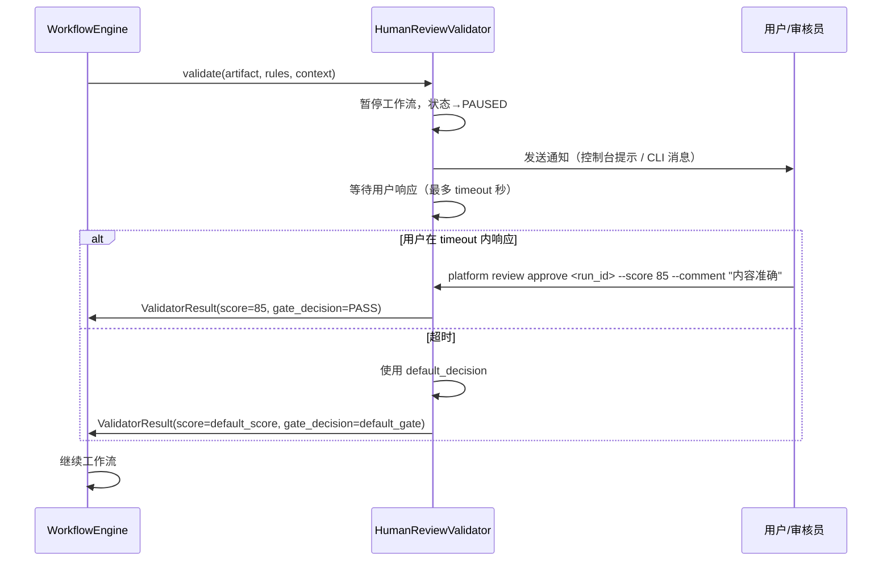
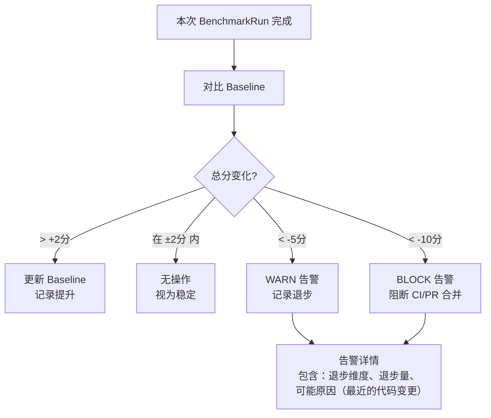
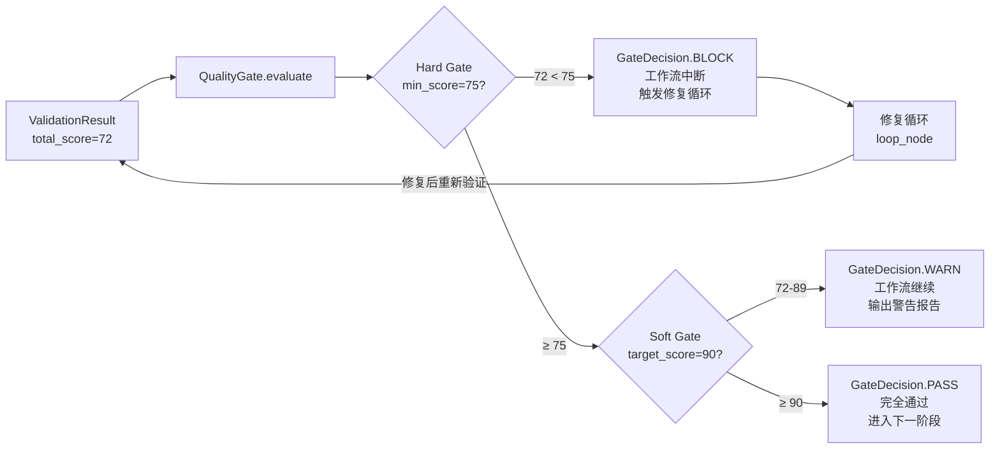
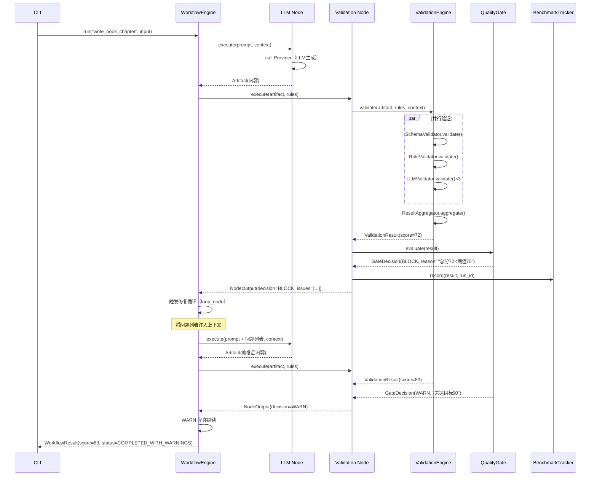

# AI Engineering Execution Platform — 验证优先设计文档

> **版本**：v0.1（P3 阶段产出）  
> **角色**：验证架构师（Validation Architect）  
> **基于**：[ARCHITECTURE.md](ARCHITECTURE.md) · [DEFINITION_OF_DONE.md](DEFINITION_OF_DONE.md)  
> **核心原则**：Validation Engine → Benchmark → Quality Gate → Execution Engine  
> **约束**：本文档为纯设计文档，不包含任何代码实现  
> **日期**：2026-06-23

---

## 目录

1. [验证优先宣言（Validation-First Manifesto）](#1-验证优先宣言)
2. [Validation Engine 详细设计](#2-validation-engine-详细设计)
3. [Benchmark 系统设计](#3-benchmark-系统设计)
4. [Quality Gate 设计](#4-quality-gate-设计)
5. [组件关系总览](#5-组件关系总览)
6. [各类 Artifact 的验证规则矩阵](#6-各类-artifact-的验证规则矩阵)
7. [验证驱动的开发流程](#7-验证驱动的开发流程)

---

## 1. 验证优先宣言

### Validation-First Manifesto

> *质量不是事后检查出来的，是设计进去的。*

---

#### 为什么质量必须由验证保证，而不是由生成器保证

**生成器的本质局限**：

任何生成器（LLM、模板、Agent）的输出本质上是概率性的。同样的输入，在不同时刻、不同温度参数、不同上下文窗口下，可能产生截然不同的输出。这不是缺陷，这是生成式 AI 的工作原理。

如果我们把质量的责任交给生成器，我们就是在赌运气：
- 今天 GPT-4 生成了一篇高质量文章，不代表明天的输出同样高质量
- 生成器不知道"什么是好的输出"，它只知道"什么是概率最高的下一个 token"
- 没有外部标准，生成器无法自我纠错

**验证器的核心价值**：

验证器是系统中唯一能够**客观评判**输出质量的组件。它持有明确的质量标准，不受概率波动影响，可以重复、一致地对任何输出做出判断。

```
错误模型：生成 → 希望质量够好 → 输出
正确模型：定义标准 → 生成 → 验证 → 不达标则修复 → 再验证 → 输出
```

**在本平台中，验证与执行的关系**：

验证不是执行的附属品，验证是执行的**前提和终止条件**：

- 没有验证规则的任务，不允许被执行（Execution Engine 拒绝接受）
- 验证不通过，执行闭环不结束（触发修复循环）
- 验证得分是平台所有优化行为的唯一量化依据

```
Validation Engine（定义"什么是好"）
        ↓ 先于
Execution Engine（负责"做出来"）
        ↓ 产出交回
Validation Engine（评判"够不够好"）
        ↓ 不够好
Execution Engine（根据问题修复）
        ↓ 循环直到
Quality Gate（宣布"通过"）
```

---

#### 开发者必须遵守的验证相关约定

**约定 1 — 新任务类型必须先有验证规则**

当任何开发者想要添加新的任务类型（如"生成 PPT"、"生成 API 文档"），必须先在 `platform/validation/rules/` 目录下定义该类型的验证规则 YAML，并在 `platform/benchmark/suites/` 下创建对应的基准测试套件，才允许开始实现生成逻辑。PR 审查会检查这一顺序。

**约定 2 — 验证节点不可绕过**

工作流定义（YAML）中，任何生成节点之后必须有验证节点。Workflow Engine 在加载工作流时会静态检查：若生成节点没有对应的下游验证节点，拒绝加载并抛出 `WorkflowDefinitionError`。

**约定 3 — 质量分是唯一的"完成"标准**

任务完成的标准不是"代码运行了"或"内容生成了"，而是"验证得分达到质量门禁阈值"。任何跳过验证直接标记任务为 `COMPLETED` 的代码，视为严重 Bug。

**约定 4 — Validator 接口不允许返回 True/False**

所有 Validator 必须返回 `ValidationResult`（含得分和问题列表），禁止返回布尔值。布尔值丢失了"为什么不通过"的信息，使修复循环无法有效工作。

**约定 5 — 每个 Validator 必须有对应的测试**

新增的 Validator 必须附带单元测试，测试必须覆盖：正常通过的案例、边界值、典型失败案例。没有测试的 Validator 在 CI 中不通过（测试覆盖率检查）。

---

## 2. Validation Engine 详细设计

### 2.1 总体架构

```mermaid
graph TD
    A[调用方<br/>WorkflowNode / Agent / CLI] -->|validate(artifact, rules, context)| B[ValidationEngine]
    
    B --> C{按规则类型路由}
    C -->|schema| D[SchemaValidator]
    C -->|rule| E[RuleValidator]
    C -->|llm| F[LLMValidator]
    C -->|code| G[CodeValidator]
    C -->|human| H[HumanReviewValidator]
    C -->|cross_ref| I[ConsistencyValidator]
    
    D --> J[ResultAggregator]
    E --> J
    F --> J
    G --> J
    H --> J
    I --> J
    
    J -->|加权平均| K[ValidationResult<br/>总分 + 维度分 + 问题列表]
    K --> L[QualityGate]
    L -->|PASS/WARN/BLOCK| M[调用方]
    K --> N[ReportGenerator]
    N -->|Markdown + JSON| O[报告输出]
```

**为什么使用路由器模式而非责任链**：路由器可以并行执行多个 Validator（互不依赖时），而责任链是串行的。对于一个 2000 字的文章，Schema 验证、字数验证、LLM 评分可以并行执行，显著减少总验证时间。

---

### 2.2 核心接口定义（伪代码）

```
# 核心接口（不是实现）

interface Validator:
    validator_type: ValidatorType      # SCHEMA / RULE / LLM / CODE / HUMAN / CONSISTENCY
    supported_artifact_types: list[ArtifactType]  # 支持的制品类型

    validate(
        artifact: Artifact,
        rules: list[ValidationRule],
        context: ValidationContext
    ) → ValidatorResult                # 单个验证器的结果（不是最终结果）

interface ValidationEngine:
    register_validator(
        validator_type: ValidatorType,
        validator_class: type[Validator]
    ) → None

    get_validators_for(
        artifact_type: ArtifactType
    ) → list[Validator]

    validate(
        artifact: Artifact,
        rules: list[ValidationRule],
        context: ValidationContext
    ) → ValidationResult               # 聚合后的最终结果

# 数据结构

ValidationContext:
    run_id: str                        # 关联的工作流运行 ID
    task_type: str                     # 任务类型（用于选择验证规则集）
    previous_results: list[ValidationResult]  # 历史验证结果（用于 Diff）
    reference_materials: list[str]    # 参考资料（用于 ConsistencyValidator）
    human_reviewer_id: str | None     # 人工审核人 ID

ValidationRule:
    type: ValidatorType
    config: dict                       # 规则配置（不同类型有不同配置结构）
    weight: float                      # 此规则在总分中的权重（所有规则权重之和=1.0）
    severity: Severity                 # BLOCKER / ERROR / WARNING（影响 Gate 决策）

ValidatorResult:
    validator_type: ValidatorType
    score: float                       # 0-100
    dimension_scores: dict[str, float] # 各维度得分
    issues: list[ValidationIssue]
    metadata: dict                     # 验证器特有的附加信息

ValidationIssue:
    issue_id: str
    location: str                      # 具体位置（行号/章节名/字段路径）
    severity: Severity                 # BLOCKER / ERROR / WARNING / INFO
    message: str                       # 问题描述
    suggestion: str                    # 修复建议（供修复循环使用）
    rule_id: str                       # 触发此问题的规则 ID

ValidationResult:
    artifact_id: str
    artifact_version: int
    total_score: float                 # 加权平均总分（0-100）
    dimension_scores: dict[str, float] # 跨验证器的维度得分汇总
    issues: list[ValidationIssue]      # 所有问题合并后去重排序
    validator_results: list[ValidatorResult]  # 各验证器的原始结果
    gate_decision: GateDecision        # PASS / WARN / BLOCK
    gate_reason: str | None            # BLOCK 时的原因说明
    duration_ms: int                   # 验证耗时
    timestamp: datetime
```

---

### 2.3 各验证器详细设计

#### 2.3.1 SchemaValidator

**职责**：验证 Artifact 的结构和数据格式是否符合预定义 Schema。

**为什么需要**：LLM 输出经常不遵守指定的格式（遗漏字段、错误嵌套、多余内容）。Schema 验证是最快速、最确定性的一层过滤。

**支持的规则配置**：

```yaml
# 示例规则
type: schema
config:
  schema_type: json_schema          # json_schema / markdown_structure / custom
  schema:
    required_fields: [title, sections, summary]
    sections:
      min_count: 3
      max_count: 10
      each:
        required_fields: [heading, content]
        content:
          min_words: 200
  strict_mode: false               # false = 额外字段允许存在
weight: 0.15
severity: ERROR
```

**评分逻辑**：
- 所有必填字段存在 → 100 分起步
- 每个缺失必填字段 → -20 分
- 每个格式错误 → -10 分
- 最低 0 分

---

#### 2.3.2 RuleValidator

**职责**：基于可配置的业务规则验证 Artifact 内容特征。

**为什么需要**：Schema 只能验证结构，不能验证内容特征。字数范围、章节完整性、禁用词检查等业务规则需要 RuleValidator。

**内置规则类型**：

```yaml
# 字数规则
- type: rule
  config:
    rules:
      - id: min_word_count
        check: word_count(content) >= 1500
        message: "内容字数不足，当前 {actual}，要求 ≥ 1500"
        suggestion: "请继续扩展内容，重点补充示例和最佳实践部分"
        
      - id: max_word_count
        check: word_count(content) <= 3000
        message: "内容超出字数上限，当前 {actual}，要求 ≤ 3000"
        suggestion: "请删减重复内容，合并相似段落"

      - id: required_sections
        check: all(s in section_headings(content) for s in ["概念介绍", "代码示例", "最佳实践"])
        message: "缺少必要章节：{missing_sections}"
        suggestion: "请补充缺失的章节，参考章节模板"

      - id: no_placeholder
        check: not contains(content, ["TODO", "PLACEHOLDER", "待补充", "..."])
        message: "内容包含占位符：{found_placeholders}"
        suggestion: "请将所有占位符替换为实际内容"
        
      - id: code_block_syntax
        check: all_code_blocks_have_language(content)
        message: "存在未标注语言的代码块"
        suggestion: "请为所有代码块添加语言标注，如 ```python"
  weight: 0.20
  severity: ERROR
```

**评分逻辑**：
- 通过所有规则 → 100 分
- 每个 BLOCKER 级规则失败 → 得分置为 0（直接 Block）
- 每个 ERROR 级规则失败 → -15 分
- 每个 WARNING 级规则失败 → -5 分

---

#### 2.3.3 LLMValidator

**职责**：使用 LLM 对 Artifact 进行多维度智能评分，模拟专家审稿人视角。

**为什么需要**：规则只能检查可量化的特征，无法评判"内容是否准确"、"表达是否清晰"等需要语义理解的维度。LLM 作为"AI 评审员"弥补这一缺口。

**为什么不直接信任单次 LLM 评分**：LLM 评分不稳定。同样的内容，在不同温度下可能得到差距超过 20 分的结果。因此需要防抖机制。

**防抖机制设计**：

```
调用流程：
1. 以 temperature=0.3 调用 LLM 评分，得到分数 S1
2. 以 temperature=0.3 再次调用，得到分数 S2
3. 以 temperature=0.3 第三次调用，得到分数 S3
4. 计算方差 Var = variance([S1, S2, S3])
5. 如果 Var > 15：继续调用至第 4、5 次
6. 取所有有效调用的中位数作为最终分

为什么用中位数而不是平均数：
中位数对极端异常值（如某次 LLM 返回 0 或 100）更鲁棒
```

**评分维度配置（书籍章节示例）**：

```yaml
type: llm
config:
  model_preference: claude-sonnet-4-6   # 首选模型（Validation 应使用较强模型）
  fallback_model: deepseek-chat
  call_count: 3                         # 基础调用次数
  variance_threshold: 15.0             # 方差超过此值时增加调用
  max_call_count: 5
  temperature: 0.3
  prompt_template: tasks/validate_output.j2
  dimensions:
    factual_accuracy:
      weight: 0.30
      description: "内容中的事实、数据、技术细节是否准确"
      scale: "0=完全错误, 50=部分准确, 100=全部准确"
    completeness:
      weight: 0.25
      description: "是否覆盖了主题的关键方面，没有明显遗漏"
      scale: "0=严重缺失, 50=基本覆盖, 100=全面深入"
    readability:
      weight: 0.20
      description: "文章结构清晰，表达流畅，易于目标读者理解"
      scale: "0=难以阅读, 50=基本可读, 100=非常流畅"
    practical_value:
      weight: 0.15
      description: "内容是否具有实际应用价值，读者能从中获得可操作的知识"
      scale: "0=纯理论无用, 50=有一定价值, 100=极具价值"
    originality:
      weight: 0.10
      description: "内容是否有独特见解，而不是对常见内容的简单重复"
      scale: "0=完全重复, 50=有些新意, 100=独特深刻"
  output_format:
    # LLM 必须按此 JSON Schema 输出，否则重试
    type: object
    required: [total_score, dimension_scores, issues]
    properties:
      total_score:
        type: number
        minimum: 0
        maximum: 100
      dimension_scores:
        type: object
      issues:
        type: array
        items:
          type: object
          required: [location, severity, message, suggestion]
weight: 0.50
severity: ERROR
```

---

#### 2.3.4 CodeValidator

**职责**：对代码类 Artifact 进行语法检查、测试执行、代码质量分析。

**为什么需要**：代码的质量验证不能依赖 LLM（LLM 可能认为有 Bug 的代码"看起来不错"）。只有实际执行才能验证代码是否工作。

**验证流程**：

```
输入：Python 文件 Artifact
    │
    ▼
语法检查（py_compile）
    │ 失败 → 得分 0，BLOCKER 问题，直接返回
    ▼
代码风格检查（ruff）
    │ 每个 violation → -2 分（最多扣 20 分）
    ▼
类型检查（mypy，可选）
    │ 每个类型错误 → -3 分（最多扣 15 分）
    ▼
安全扫描（bandit）
    │ HIGH 级别问题 → -10 分/个，MEDIUM → -5 分/个
    ▼
测试执行（pytest，如有测试文件）
    │ 测试失败数 / 总测试数 决定扣分
    │ 覆盖率 < 目标值 → 按差距扣分
    ▼
最终得分（0-100）
```

**规则配置示例**：

```yaml
type: code
config:
  language: python
  checks:
    syntax: {enabled: true, weight: 1.0, blocker_on_fail: true}
    style:  {enabled: true, tool: ruff, weight: 0.15, max_penalty: 20}
    types:  {enabled: false, tool: mypy}
    security: {enabled: true, tool: bandit, high_penalty: 10, medium_penalty: 5}
    tests:
      enabled: true
      auto_discover: true              # 自动发现同目录下的 test_*.py
      run_timeout: 60                  # 秒
      min_coverage: 80
      coverage_penalty_per_point: 2   # 覆盖率每差 1 点扣 2 分
  sandbox:
    enabled: true
    allowed_imports: [os, sys, pathlib, re, json, datetime, typing, dataclasses]
    blocked_commands: [rm, rmdir, shutdown, format]
    timeout: 120
weight: 0.40
severity: BLOCKER
```

---

#### 2.3.5 HumanReviewValidator

**职责**：在工作流中插入人工审核节点，将验证决策权交给真实用户。

**为什么需要**：对于高风险输出（如公开发布的文章、生产代码），机器验证不足以保证质量。人工审核是最终防线。

**交互流程**：



**规则配置示例**：

```yaml
type: human
config:
  reviewer_prompt: |
    请审核以下内容，评分标准：
    - 0-59：质量不达标，需要重写
    - 60-74：基本可用，但有明显问题
    - 75-89：质量良好，可以发布
    - 90-100：优秀，可以直接使用
  timeout_seconds: 3600            # 等待 1 小时
  default_decision:
    score: 70
    gate: WARN
    comment: "审核超时，按默认分数处理"
  notification:
    channel: console               # console / slack / email
weight: 0.30
severity: ERROR
```

---

#### 2.3.6 ConsistencyValidator

**职责**：跨文件/跨章节检查内容的一致性，防止同一概念在不同地方有矛盾的描述。

**为什么需要**：在生成长篇内容（如完整书籍）时，不同章节由不同 Agent 或不同轮次生成，极容易出现术语不一致、数据矛盾、前后矛盾等问题。

**验证策略**：

```
策略 1：术语一致性
    - 提取所有章节中的技术术语列表
    - 检查同一概念是否使用一致的称呼（如 "异步" vs "async" vs "非同步"）
    - 使用 LLM 判断两个词是否指代同一概念

策略 2：数据一致性
    - 提取所有数字声明（如 "性能提升 30%"）
    - 跨章节对比相同主题的数字，差异 > 20% 时报告问题

策略 3：逻辑一致性
    - 使用 LLM 对比前后章节的结论，检测逻辑矛盾
    - 例如：第1章说 "A 优于 B"，第3章说 "B 是最佳选择"

策略 4：引用一致性
    - 检查所有内部引用（"详见第X章"）的目标是否存在
    - 检查所有代码引用（函数名、类名）是否在代码章节中定义
```

---

### 2.4 ResultAggregator 设计

**职责**：将多个 Validator 的结果汇总为一个最终的 `ValidationResult`。

**聚合算法**：

```
total_score = sum(
    validator_result.score * rule.weight
    for validator_result, rule in zip(results, rules)
)

# 维度分：跨验证器的同名维度取加权平均
dimension_scores = {}
for dimension in all_dimensions:
    scores = [r.dimension_scores[dimension] for r in results if dimension in r.dimension_scores]
    weights = [...]
    dimension_scores[dimension] = weighted_average(scores, weights)

# 问题合并：按严重程度排序，去除重复问题（相同位置+相同类型）
issues = deduplicate(
    sorted(
        [issue for result in results for issue in result.issues],
        key=lambda i: severity_order[i.severity]
    )
)
```

**为什么不简单求平均**：不同验证器的重要性不同。对于代码 Artifact，CodeValidator（实际执行）的权重应高于 LLMValidator（主观评分）。YAML 配置的 `weight` 字段允许精细控制。

---

### 2.5 插件注册机制

```
ValidatorRegistry（全局单例）:
    _registry: dict[ValidatorType, type[Validator]] = {}

    @classmethod
    register(type: ValidatorType, cls: type[Validator]):
        检查 cls 是否实现了 Validator 接口
        检查 type 是否已注册（重复注册告警）
        _registry[type] = cls

    @classmethod
    get(type: ValidatorType) → type[Validator]:
        return _registry.get(type) or raise UnknownValidatorTypeError

    @classmethod
    get_validators_for(artifact_type: ArtifactType) → list[Validator]:
        读取 artifact_type 对应的默认规则集（YAML 配置）
        返回规则集中涉及的所有 Validator 实例

# 注册示例（在 platform/validation/__init__.py 中）
ValidatorRegistry.register(ValidatorType.SCHEMA, SchemaValidator)
ValidatorRegistry.register(ValidatorType.RULE, RuleValidator)
ValidatorRegistry.register(ValidatorType.LLM, LLMValidator)
ValidatorRegistry.register(ValidatorType.CODE, CodeValidator)
ValidatorRegistry.register(ValidatorType.HUMAN, HumanReviewValidator)
ValidatorRegistry.register(ValidatorType.CONSISTENCY, ConsistencyValidator)
```

**为什么用注册表而不是 if/elif**：注册表模式使添加新 Validator 类型不需要修改核心代码，只需新建一个类并调用 `register()`。开放/封闭原则的直接体现。

---

## 3. Benchmark 系统设计

### 3.1 总体架构

```mermaid
graph LR
    A[CI/CD<br/>或手动触发] -->|run(suite_name)| B[BenchmarkRunner]
    
    B -->|加载| C[BenchmarkSuite<br/>YAML 定义]
    C -->|包含| D[BenchmarkTask × N]
    
    B -->|对每个 Task| E[执行目标<br/>Provider/Prompt/Workflow/Agent]
    E -->|产生| F[Artifact]
    F -->|送入| G[ValidationEngine]
    G -->|返回| H[ValidationResult<br/>含得分]
    
    H --> I[BenchmarkTracker]
    I -->|持久化| J[(历史数据库<br/>SQLite)]
    
    I --> K[RegressionDetector]
    K -->|对比 Baseline| L{是否退步?}
    L -->|是| M[RegressionAlert]
    L -->|否| N[更新 Baseline?]
    
    I --> O[Leaderboard]
    I --> P[TrendAnalyzer]
    O --> Q[BenchmarkReporter]
    P --> Q
    Q -->|输出| R[Markdown + JSON 报告]
```

---

### 3.2 核心数据结构

```
BenchmarkSuite:
    name: str                           # 套件名称（唯一标识）
    version: str                        # 套件版本
    description: str
    tasks: list[BenchmarkTask]
    default_target: BenchmarkTarget     # 默认测试目标
    scoring_rubric: ScoringRubric      # 评分标准

BenchmarkTask:
    id: str
    type: ArtifactType                  # 任务类型
    prompt: str                         # 任务描述（发给 LLM 的输入）
    context: dict                       # 附加上下文
    expected: dict                      # 期望特征（非精确答案）
    validation_rules: list[ValidationRule]  # 该 Task 专用的验证规则
    baseline_score: float | None        # 历史最佳得分（首次运行后自动建立）
    tags: list[str]                     # 标签（用于过滤运行特定 Task）

BenchmarkTarget:
    type: TargetType                    # PROVIDER / PROMPT / WORKFLOW / AGENT
    config: dict                        # 目标配置（如 provider_name="openai"）

ScoringRubric:
    dimensions: dict[str, DimensionConfig]
    weights: dict[str, float]           # 各维度权重

BenchmarkRun:
    run_id: str
    suite_name: str
    suite_version: str
    target: BenchmarkTarget
    started_at: datetime
    completed_at: datetime
    task_results: list[BenchmarkTaskResult]
    aggregate_score: float              # 所有 Task 的平均分
    regression_status: RegressionStatus # OK / WARN / BLOCK

BenchmarkTaskResult:
    task_id: str
    artifact: Artifact                  # 生成的制品
    validation_result: ValidationResult
    score: float
    duration_ms: int
    cost_usd: float
    compared_to_baseline: float | None  # 与基准的差值（正=提升，负=退步）
```

---

### 3.3 四类基准测试目标

#### 3.3.1 Provider Benchmark

**测试维度**：

| 维度 | 测量方式 | 权重 |
|------|---------|------|
| 输出质量 | ValidationEngine 评分 | 50% |
| 响应速度 | 首 token 延迟 + 总耗时 | 20% |
| 成本效益 | 质量分 / 每千 token 费用 | 20% |
| 稳定性 | 10 次调用的得分标准差 | 10% |

**典型 Provider Leaderboard 输出**：

```
Provider Benchmark — 书籍章节写作（10 次平均）
┌──────────────────────┬──────┬────────┬──────────┬──────────┬─────────────┐
│ Provider             │ 质量分│ 首token│ 费用/千字 │ 稳定性   │ 综合得分     │
│                      │ /100  │ 延迟ms │ USD      │ σ        │ /100        │
├──────────────────────┼──────┼────────┼──────────┼──────────┼─────────────┤
│ claude-sonnet-4-6    │ 91.3  │ 820    │ $0.045   │ 2.1      │ 88.4        │
│ gpt-4o               │ 89.7  │ 650    │ $0.030   │ 3.4      │ 86.2        │
│ deepseek-chat (API)  │ 86.2  │ 1200   │ $0.004   │ 4.1      │ 85.7        │
│ deepseek (Browser)   │ 85.8  │ 2800   │ $0.000   │ 6.2      │ 79.3        │
│ llama3:8b (Ollama)   │ 78.4  │ 450    │ $0.000   │ 5.8      │ 74.1        │
└──────────────────────┴──────┴────────┴──────────┴──────────┴─────────────┘
```

#### 3.3.2 Prompt Template Benchmark

**测试方法**：
- 固定 Provider（如 `gpt-4o-mini`）
- 对同一任务，分别使用不同版本的 Prompt Template
- 各运行 5 次，取中位数
- 对比各版本的平均得分

**典型场景**：Prompt 优化实验

```
write_chapter.j2 历史版本对比：
v1（原始版本）：平均分 72.3，稳定性 σ=8.2
v2（增加了"思维链"指令）：平均分 79.1，稳定性 σ=5.4
v3（增加了"反例"约束）：平均分 84.7，稳定性 σ=4.1  ← 当前推荐版本
v4（过度约束版本）：平均分 81.2，稳定性 σ=3.9
```

#### 3.3.3 Workflow Benchmark

**测试维度**：

| 维度 | 测量方式 |
|------|---------|
| 最终输出质量 | ValidationEngine 对最终 Artifact 评分 |
| 修复循环次数 | 平均需要几轮才通过 Quality Gate |
| 总执行时间 | 从触发到完成的时钟时间 |
| 总费用 | 整个工作流消耗的 token 费用 |
| 成功率 | 在 max_iterations 内成功完成的比例 |

#### 3.3.4 Agent Benchmark

**测试维度**：

| 维度 | 测量方式 |
|------|---------|
| 任务完成率 | 成功完成任务（不因循环/超时中止）的比例 |
| 输出质量 | 完成任务时的 ValidationEngine 得分 |
| 工具调用效率 | 完成任务所需的平均工具调用次数 |
| ReAct 轮次 | 平均迭代轮次（越少越高效） |

---

### 3.4 回归检测策略



**Baseline 管理规则**：
- Baseline 不会因为得分下降而自动更新（防止"往低处跑"）
- Baseline 因得分提升而更新时，记录提升时间和对应的 Git commit
- 人工可以强制回滚 Baseline（`platform benchmark reset-baseline <suite>`）

---

### 3.5 内置基准套件设计

#### book_chapter_suite.yaml（书籍章节写作）

```yaml
name: book_chapter_suite
version: "1.0"
description: 评估平台在技术书籍章节写作任务上的能力

tasks:
  - id: python_asyncio_basics
    type: BOOK_CHAPTER
    prompt: "写一篇介绍 Python asyncio 基础概念的技术文章，面向有 Python 基础但不熟悉异步编程的开发者"
    expected:
      min_word_count: 1500
      max_word_count: 2500
      required_sections: ["概念介绍", "代码示例", "常见错误", "最佳实践"]
    validation_rules:
      - {type: rule, weight: 0.20, config: {rules: [min_word_count: 1500, ...]}}
      - {type: llm, weight: 0.50, config: {dimensions: [factual_accuracy, readability, ...]}}
      - {type: schema, weight: 0.30, config: {schema_type: markdown_structure}}

  - id: docker_containerization
    type: BOOK_CHAPTER
    prompt: "写一篇关于 Docker 容器化最佳实践的章节，包含实际的 Dockerfile 示例"
    expected:
      min_word_count: 2000
      code_blocks: {min_count: 3, languages: [dockerfile, bash]}

  - id: database_indexing_strategy
    type: BOOK_CHAPTER
    prompt: "解释数据库索引的工作原理和选择策略，面向后端开发者"
    expected:
      min_word_count: 1800
      required_sections: ["索引类型", "适用场景", "性能影响", "实际案例"]

scoring_rubric:
  dimensions:
    factual_accuracy: {weight: 0.30}
    completeness: {weight: 0.25}
    readability: {weight: 0.20}
    practical_value: {weight: 0.15}
    code_quality: {weight: 0.10}
```

#### code_generation_suite.yaml（代码生成）

```yaml
name: code_generation_suite
version: "1.0"
tasks:
  - id: python_rest_client
    type: CODE_FILE
    prompt: "实现一个 Python REST API 客户端类，支持 GET/POST/PUT/DELETE，带重试和超时"
    expected:
      language: python
      tests_required: true
      min_coverage: 80
    validation_rules:
      - {type: code, weight: 0.60, config: {language: python, checks: [syntax, style, tests]}}
      - {type: llm, weight: 0.40, config: {dimensions: [code_quality, readability, correctness]}}

  - id: typescript_data_parser
    type: CODE_FILE
    prompt: "实现一个 TypeScript 函数，解析 CSV 文件并返回类型安全的数据结构"
```

---

## 4. Quality Gate 设计

### 4.1 门禁类型



**三种门禁类型详解**：

| 类型 | 触发条件 | 工作流行为 | 典型应用场景 |
|------|---------|-----------|------------|
| **Hard Gate** | 分数 < hard.min_score，或任一 BLOCKER 问题存在 | **中断**，触发修复循环（或报错退出） | 代码有语法错误、内容严重缺失 |
| **Soft Gate** | 分数 ≥ hard.min_score 但 < soft.target_score | **继续**，输出警告，记录待改进项 | 质量合格但未达到理想标准 |
| **Progressive Gate** | 随迭代轮次提高阈值 | 修复循环中逐步提高要求 | 多轮迭代优化场景 |

**Progressive Gate 示例**：

```yaml
quality_gates:
  book_chapter:
    progressive:
      enabled: true
      schedule:
        - iteration: 1
          min_score: 60        # 第一轮允许较低分（先有再好）
        - iteration: 2
          min_score: 72        # 第二轮提高要求
        - iteration: 3
          min_score: 80        # 第三轮接近目标
        - iteration: 4+
          min_score: 85        # 后续轮次稳定目标
      max_iterations: 5        # 超过 5 轮视为失败，人工介入
```

**为什么设计 Progressive Gate**：要求第一轮就达到 80 分会导致 LLM 生成过于谨慎的内容（宁可平淡也不出错）。允许先生成较低质量的初稿，在修复循环中逐步完善，更符合工程实际。

---

### 4.2 门禁触发点

```mermaid
graph TD
    subgraph 任务级别
        A1[任务执行节点完成] -->|立即触发| B1[Node-Level Gate]
        B1 -->|BLOCK| C1[触发节点级修复]
    end
    
    subgraph 工作流级别
        A2[工作流所有节点完成] -->|触发| B2[Workflow-Level Gate]
        B2 -->|BLOCK| C2[整体质量不达标告警]
    end
    
    subgraph 里程碑级别
        A3[里程碑所有任务完成] -->|触发| B3[Milestone Gate<br/>DoD 检查清单]
        B3 -->|BLOCK| C3[禁止进入下一里程碑]
    end
    
    subgraph CI/CD级别
        A4[Git Push / PR 创建] -->|触发| B4[CI Gate<br/>Benchmark 回归检测]
        B4 -->|BLOCK| C4[阻断 PR 合并]
    end
```



---

### 4.3 完整门禁配置格式（YAML）

```yaml
# platform/validation/gates/book_chapter.yaml
quality_gates:
  book_chapter:
    description: "技术书籍章节写作的质量门禁标准"
    
    hard:
      # 必须通过，否则阻断流程
      min_total_score: 75
      required_dimensions:
        factual_accuracy:
          min: 70
          blocker: true              # 此维度单独不达标也触发 BLOCK
        completeness:
          min: 65
      required_rules_pass:
        - no_placeholder             # 此规则必须通过（不计入得分，直接强制）
        - no_syntax_error
      max_blocker_issues: 0          # 0 个 BLOCKER 级问题

    soft:
      # 通过 Hard Gate 但未达到此标准时，输出 WARN
      target_total_score: 90
      target_dimensions:
        readability: {target: 85}
        practical_value: {target: 80}
      
    progressive:
      enabled: false                 # 书籍章节不使用渐进式（直接要求高质量）

# platform/validation/gates/code_file.yaml
quality_gates:
  code_file:
    description: "代码文件质量门禁标准"
    
    hard:
      min_total_score: 70
      required_rules_pass:
        - syntax_check               # 语法正确是硬性前提
        - tests_pass                 # 所有测试必须通过
      required_dimensions:
        code_correctness:
          min: 80
          blocker: true
      max_blocker_issues: 0
      special_conditions:
        - condition: "tests_pass == false"
          action: BLOCK
          reason: "测试未通过，禁止合并"
        - condition: "coverage < 70"
          action: BLOCK
          reason: "测试覆盖率低于 70%，禁止合并"
    
    soft:
      target_total_score: 85
      target_dimensions:
        code_quality: {target: 90}   # 代码质量目标更高

# platform/validation/gates/data_analysis.yaml
quality_gates:
  data_analysis:
    description: "数据分析报告质量门禁"
    
    hard:
      min_total_score: 72
      required_dimensions:
        analytical_rigor: {min: 75, blocker: true}
        data_accuracy: {min: 80, blocker: true}
    
    soft:
      target_total_score: 88
    
    progressive:
      enabled: true                  # 数据分析报告适合渐进式改进
      schedule:
        - {iteration: 1, min_score: 60}
        - {iteration: 2, min_score: 72}
        - {iteration: 3+, min_score: 80}
      max_iterations: 4
```

---

### 4.4 Gate 决策流程

```
QualityGate.evaluate(result: ValidationResult) → GateDecision:

步骤 1：检查 BLOCKER 问题
    if any(issue.severity == BLOCKER for issue in result.issues):
        return GateDecision(
            decision=BLOCK,
            reason=f"存在 {blocker_count} 个 BLOCKER 级问题：{blocker_issues[0].message}"
        )

步骤 2：检查 Hard Gate 维度分
    for dimension, config in hard.required_dimensions.items():
        if result.dimension_scores.get(dimension, 0) < config.min:
            if config.blocker:
                return GateDecision(BLOCK, reason=f"维度 {dimension} 得分不足")

步骤 3：检查 Hard Gate 总分
    if result.total_score < hard.min_total_score:
        return GateDecision(
            decision=BLOCK,
            reason=f"总分 {result.total_score:.1f} < 阈值 {hard.min_total_score}",
            deficit=hard.min_total_score - result.total_score
        )

步骤 4：检查 Soft Gate
    warnings = []
    if result.total_score < soft.target_total_score:
        warnings.append(f"总分未达到目标 {soft.target_total_score}，当前 {result.total_score:.1f}")
    for dimension, config in soft.target_dimensions.items():
        if result.dimension_scores.get(dimension, 0) < config.target:
            warnings.append(f"维度 {dimension} 未达到目标")
    
    if warnings:
        return GateDecision(WARN, warnings=warnings)

步骤 5：全部通过
    return GateDecision(PASS)
```

---

## 5. 组件关系总览

### 5.1 验证优先全局架构

```mermaid
graph TD
    subgraph 定义层（先于执行）
        A[ArtifactType 定义] --> B[ValidationRule 定义]
        B --> C[QualityGate 配置]
        C --> D[BenchmarkSuite 定义]
    end
    
    subgraph 执行层
        E[WorkflowEngine] --> F[ExecutionNode<br/>LLM生成]
        F --> G[Artifact]
    end
    
    subgraph 验证层（控制执行）
        G --> H[ValidationEngine]
        H --> I[ValidatorRegistry]
        I --> J[SchemaValidator]
        I --> K[RuleValidator]
        I --> L[LLMValidator]
        I --> M[CodeValidator]
        I --> N[HumanReviewValidator]
        I --> O[ConsistencyValidator]
        J & K & L & M & N & O --> P[ResultAggregator]
        P --> Q[ValidationResult]
        Q --> R[QualityGate]
    end
    
    subgraph 决策层
        R -->|PASS| S[继续工作流]
        R -->|WARN| T[继续 + 记录警告]
        R -->|BLOCK| U[触发修复循环]
        U --> F
    end
    
    subgraph 学习层
        Q --> V[BenchmarkTracker]
        V --> W[RegressionDetector]
        V --> X[Leaderboard]
        V --> Y[TrendAnalyzer]
        W & X & Y --> Z[BenchmarkReport]
    end
```

### 5.2 数据流时序（书籍章节生成）



---

## 6. 各类 Artifact 的验证规则矩阵

| Artifact 类型 | SchemaValidator | RuleValidator | LLMValidator | CodeValidator | 推荐 Hard Gate |
|--------------|:--------------:|:-------------:|:------------:|:-------------:|:--------------:|
| BOOK_CHAPTER | ✅ 结构检查 | ✅ 字数/章节 | ✅ 多维度评分 | — | 75 |
| CODE_FILE | — | ✅ 语法/风格 | ✅ 代码质量 | ✅ 执行测试 | 70（测试必须通过） |
| TEST_SUITE | — | ✅ 覆盖率检查 | ✅ 测试设计质量 | ✅ 执行验证 | 75 |
| DATA_ANALYSIS | ✅ 输出格式 | ✅ 完整性 | ✅ 分析准确性 | ✅ 代码可执行 | 72 |
| COURSE_MODULE | ✅ 结构检查 | ✅ 字数/练习题 | ✅ 教学质量 | — | 78 |
| API_SPEC | ✅ OpenAPI Schema | ✅ 端点完整性 | ✅ 文档质量 | ✅ 可解析验证 | 80 |
| WEBSITE_PAGE | ✅ HTML 结构 | ✅ 可访问性规则 | ✅ 内容质量 | ✅ 渲染无错 | 72 |

**为什么不同类型有不同门禁阈值**：
- 代码文件要求测试通过（硬性条件），总分阈值略低（70），但有 BLOCKER 级前置条件
- 课程内容直接面向学习者，质量要求更高（78）
- API 文档是合约，准确性最关键，阈值最高（80）

---

## 7. 验证驱动的开发流程

### 7.1 新增任务类型的标准步骤

```
步骤 1：定义 ArtifactType
        → 在 platform/core/models/artifact.py 中添加枚举值

步骤 2：定义验证规则（必须在实现生成逻辑之前完成）
        → 在 platform/validation/rules/<type>.yaml 中定义规则集

步骤 3：定义质量门禁
        → 在 platform/validation/gates/<type>.yaml 中定义 Hard/Soft Gate

步骤 4：创建基准测试套件
        → 在 platform/benchmark/suites/<type>_suite.yaml 中定义 3-5 个标准任务

步骤 5：提交 PR，通过 CI 检查（此时验证框架就绪，但没有生成器）
        → CI 会检查：validation_rules 文件存在，benchmark_suite 文件存在

步骤 6：实现生成逻辑（Workflow 模板 / Agent 专用提示词）

步骤 7：运行 Benchmark，建立 Baseline
        → platform benchmark run <type>_suite --set-baseline

步骤 8：后续优化循环（调整提示词 → Benchmark → 对比 → 更新 Baseline）
```

### 7.2 验证优先带来的质量飞轮

```
清晰的验证标准
    → LLM 可以在 Prompt 中被告知"好的输出"的标准
    → 验证失败时可以把具体问题告诉 LLM（修复循环）
    → Benchmark 记录每次优化的效果
    → 最优 Prompt 版本被固定
    → 质量稳步提升
    → 新任务类型复用已有的验证框架
    → 整个平台质量飞轮正向循环
```

---

*本文档由验证架构师在 P3 阶段产出。验证优先不是限制，是保障——没有质量标准的生成是随机的赌博，有了验证闭环的生成才是可靠的工程。*
